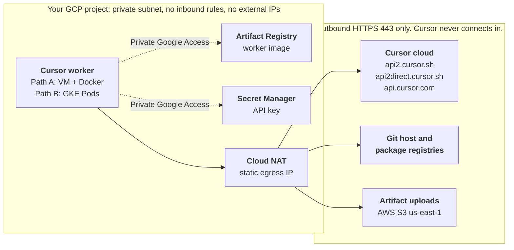

# Self-Hosted Cloud Agents on GCP

This repository shows how to run Cursor Cloud Agents on Google Cloud with self-hosted Team Pool workers (`agent worker --pool`). Cursor still handles orchestration, model inference, and the Cloud Agents experience, while workers run inside your GCP project to clone repos, run commands, edit files, execute builds and tests, and reach internal services.

Workers connect outbound to Cursor over HTTPS. No inbound access to the worker is required, workers have no external IPs, and egress leaves through Cloud NAT on one static IP you can allowlist.

It is a GCP port of Hassan Saab's AWS lab, [hsaab/self-hosted-cloud-agents-lab](https://github.com/hsaab/self-hosted-cloud-agents-lab), and keeps its layout and shared worker files.

> **Status: validated offline only.** The Terraform, startup script, Dockerfile, Helm values, and gcloud flags were checked with real tools (see [Validation](#validation)), but nothing in this repo has been deployed to a live GCP project yet. Run it end to end in a sandbox project first, and review [Open Items To Confirm](#open-items-to-confirm).

## Architecture



Workers open a long-lived outbound HTTPS connection to Cursor. Cursor sends tool calls over that connection and never connects into your network. Google APIs (Artifact Registry, Secret Manager) are reached through Private Google Access. Everything else leaves through Cloud NAT.

## Infrastructure Guides

| Infrastructure | General README | Implementation README |
| --- | --- | --- |
| A. Compute Engine + Docker | [`gce/README.md`](gce/README.md) | [`gce/terraform/README.md`](gce/terraform/README.md) |
| B. GKE Standard + Helm | [`gke/README.md`](gke/README.md) | [`gke/helm/README.md`](gke/helm/README.md) |

Use the general READMEs for architecture, trade-offs, validation expectations, and troubleshooting. Use the implementation READMEs when you need copy-paste setup commands.

| Path | Best for | Scaling | Mirrors in the AWS lab |
| --- | --- | --- | --- |
| A. Compute Engine + Docker (Terraform) | Proofs of concept, one repo-bound worker | One worker per VM | `ec2/` |
| B. GKE Standard + `k8s-workers` Helm chart | Teams, concurrent sessions, many repos | One Pod per claimed request, or N warm idle workers | `eks/` (on Cursor's current chart) |

ECS/Fargate is intentionally not ported. Its Lambda metrics publisher and CloudWatch scaling are AWS-specific, and the GKE controller in Path B covers that job.

## Prerequisites

### Cursor

- Cursor Enterprise plan. A team admin turns on **Allow Self-Hosted Machines** in **Dashboard > Cloud Agents > Self-Hosted**.
- A Cursor **service account API key**. Pool workers reject personal, user, team, and organization keys.
- The Cursor GitHub App installed with access to the target repository (required by the lab's validation steps and by `--clone-git-repos`).

### Google Cloud

- A project with billing enabled.
- Roles for the operator: Compute Admin, Artifact Registry Admin, Secret Manager Admin, Service Account Admin, Service Account User, Project IAM Admin.
- Path A SSH also needs IAP-secured Tunnel User and Compute OS Admin Login (see [`gce/terraform/README.md`](gce/terraform/README.md), step 7).
- Path B also needs Kubernetes Engine Admin.

### Tools

- `gcloud` CLI and Docker with `buildx`.
- Path A: Terraform 1.6 or later.
- Path B: `kubectl`, Helm 3.8 or later (Helm 4 also works), and `gke-gcloud-auth-plugin`.

Run all commands from the root of this repo. The image build uses `docker/` and `config/` from here.

## Required Egress

Workers need outbound HTTPS (443) to the hosts below. If you use a proxy, set `HTTPS_PROXY` in the worker environment.

| Host | Used for | Source |
| --- | --- | --- |
| `api2.cursor.sh`, `api2direct.cursor.sh` | Agent session (required) | Cursor docs |
| `api.cursor.com` | Pool API and the GKE worker controller (CLI default endpoint) | Cursor docs, CLI help |
| `downloads.cursor.com` | Cursor CLI updates | Cursor docs |
| `cloud-agent-artifacts.s3.us-east-1.amazonaws.com` | Artifact uploads (screenshots, videos, log references). Blocking it only disables artifacts. | Cursor docs |
| Your Git host and package registries | Clones, fetches, dependency installs | Cursor docs |
| `REGION-docker.pkg.dev`, `secretmanager.googleapis.com` | Image pulls and secret reads, over Private Google Access | GCP |
| `deb.debian.org`, `packages.cloud.google.com` | Path A only: Docker and Git install on first boot | Debian image defaults |

## Worker Image

Both paths use one image built from [`docker/Dockerfile.gcp`](docker/Dockerfile.gcp). It is the AWS lab's `docker/Dockerfile` without the AWS CLI, plus `kubectl`, so the same image also runs the GKE controller. [`docker/entrypoint.sh`](docker/entrypoint.sh) and [`config/labels.json`](config/labels.json) are unchanged from the lab.

- Pin `KUBECTL_VERSION` to within one minor version of your GKE control plane (Kubernetes version skew policy). GKE Regular channel currently defaults to 1.35 or 1.36. The Dockerfile pins `v1.36.5`.
- The Cursor install script installs the one CLI build it points to (`2026.10.01-e373342` when this repo was checked). For repeatable builds, keep a reviewed copy of the script in your repo and run that copy.

## Repository Layout

```text
.
├── Makefile                 make help lists shortcuts for both paths
├── .env.example             copy to .env
├── config/labels.json       worker labels (from the AWS lab)
├── docker/                  Dockerfile.gcp and entrypoint.sh
├── gce/                     Path A: Compute Engine + Docker
│   └── terraform/           main.tf, variables.tf, outputs.tf, startup.sh.tpl
├── gke/                     Path B: GKE Standard + k8s-workers chart
│   └── helm/                values.yaml and scripts/
└── scripts/check.sh         offline checks (make check)
```

## AWS To GCP Mapping

| AWS lab | This repo (GCP) |
| --- | --- |
| EC2 host + user data | Compute Engine VM (Debian 12, Shielded VM) + startup script that reruns every boot |
| ECR | Artifact Registry (Docker) |
| Secrets Manager | Secret Manager. Key added with `gcloud`, never in Terraform state |
| IAM role + instance profile | Service account with Artifact Registry Reader on the repo and Secret Accessor on the secret |
| SSM Session Manager | IAP TCP forwarding with OS Login |
| Security group, public IP in the default VPC | Custom VPC, IAP SSH only, no external IP, Cloud NAT with a static IP |
| IMDSv2, encrypted EBS | Metadata server requires the `Metadata-Flavor` header, Persistent Disk encrypted by default |
| EKS via `eksctl` | GKE Standard, private nodes, dedicated node service account |
| `worker-set-controller` + `WorkerDeployment` CRD | `anysphere/k8s-workers` chart (`agent worker controller`) |
| Prometheus + CronJob scaler | Not needed. The controller spawns per request or keeps N warm |
| ECS/Fargate + Lambda metrics publisher | Not ported. Use Path B |
| AWS CLI in the image | Removed. `kubectl` added for the GKE controller |

## What Differs From The AWS Lab

- Path B uses Cursor's current `k8s-workers` chart. The lab's EKS path uses the `worker-set-controller` operator and `WorkerDeployment` CRD, which Cursor's docs now mark deprecated. Existing operator installs keep working.
- No Prometheus or CronJob scaler. The controller claims each pending request and spawns a Pod, or keeps a fixed number warm.
- Path B workers serve an any-repo pool. The chart starts `agent` directly, so `docker/entrypoint.sh` is skipped.
- ECS/Fargate is not ported. Its Lambda metrics publisher and CloudWatch scaling are AWS-specific, and the controller covers that job.
- Workers have no external IP. Cloud NAT provides one static egress IP for allowlists.
- The Path A startup script reruns on every boot, so key rotation means adding a secret version and rerunning the script, not replacing the instance.
- Path A can clone the repository on first boot with a read-only token. The lab only initializes an empty git repository.
- `entrypoint.sh` passes `--pool --pool-name`, which still works. Cursor's docs list `--pool-name` as a deprecated alias for `--pool NAME`.

## Open Items To Confirm

1. **Repo-bound VM workers and code.** The AWS lab (and Path A without the Git token) only runs `git init` with an origin and never clones. Cursor's docs say repo-backed pool workers use existing checkouts and do not clone, so without the token the agent likely sees an empty workspace. The first-boot clone was tested with a stub and a rejected dummy token only. Confirm with a real read token, and confirm how the agent pushes branches and opens PRs from a repo-bound worker (for example `--mint-github-token`, which needs team-admin enablement and an entrypoint change).
2. **Team enablement.** `--clone-git-repos` (and `--mint-github-token`) need a team admin to enable GitHub token minting for Team Pool workers. Session tokens need private-worker session tokens enabled for the team by Cursor. Confirm both before relying on them.
3. **Data residency.** Artifact uploads (screenshots, videos, log references) go to `cloud-agent-artifacts.s3.us-east-1.amazonaws.com`, an AWS S3 bucket in us-east-1, even when workers run on GCP. File chunks the model reads also leave your network during inference. Review with FSI data-residency and security teams. Blocking the S3 host disables artifacts only.
4. **Untested variants.** GKE Autopilot and Cloud Run worker pools were not evaluated. Version pins are choices, not requirements: `k8s-workers` 0.2.2 (latest release, Oct 6, 2026), `kubectl` v1.36.5, Debian 12 boot image, Ubuntu 24.04 base image, google provider `~> 6.0` (7.x and 8.x exist), and the Cursor CLI build the install script points to.
5. **Live deployment.** Run both paths end to end in a sandbox project before customer use.

## Validation

No GCP project was available, so nothing was deployed. `make check` reruns the offline checks in [`scripts/check.sh`](scripts/check.sh):

- `terraform fmt -check` and `terraform validate` on `gce/terraform`.
- The startup script rendered through Terraform `templatefile` (with and without the Git token), then `bash -n` and ShellCheck, along with every other shell script.
- `hadolint` on `docker/Dockerfile.gcp`.
- `helm template` of `k8s-workers` 0.2.2 with `gke/helm/values.yaml`, plus the `--clone-git-repos` and session-token variants. Session tokens with `warmIdle=1` must fail, as the chart documents.
- The Mermaid diagram above, rendered with mermaid-cli.

The source guide was also checked further before this repo was built: `terraform test` with a mocked google provider, a stubbed run of the startup script, a `linux/amd64` image build in which the entrypoint reached Cursor authentication (rejected only because a dummy key was used), `kubeconform` against Kubernetes 1.36 on the rendered chart, and every `gcloud` flag checked against Google Cloud CLI 588.0.0.

## References

- AWS lab: https://github.com/hsaab/self-hosted-cloud-agents-lab
- Cursor Team Pools: https://cursor.com/docs/cloud-agent/self-hosted-guides/pool
- Cursor Self-Hosted Machines: https://cursor.com/docs/cloud-agent/self-hosted
- `k8s-workers` chart: https://github.com/anysphere/k8s-workers
- GKE node service accounts: https://docs.cloud.google.com/kubernetes-engine/security/configure-node-service-accounts
- IAP TCP forwarding: https://cloud.google.com/iap/docs/using-tcp-forwarding
- OS Login roles: https://cloud.google.com/compute/docs/oslogin/set-up-oslogin

## Credit And License

Based on Hassan Saab's [self-hosted-cloud-agents-lab](https://github.com/hsaab/self-hosted-cloud-agents-lab). Released under the [MIT License](LICENSE).
