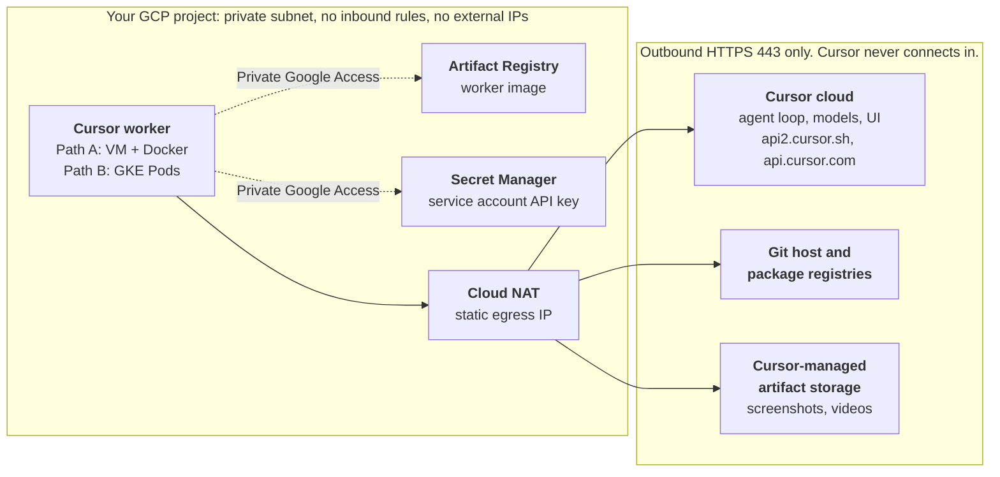

# Cursor Self-Hosted Cloud Agents on Google Cloud

A hands-on lab for running Cursor [Team Pool](https://cursor.com/docs/cloud-agent/self-hosted/pool) workers (`agent worker --pool`) in your own GCP project. Cursor runs the agent loop, models, and UI. Your workers run the tool calls (terminal commands, file edits, builds, tests) inside a private VPC, with outbound HTTPS only.

> **Status: validated offline, never deployed.** Terraform, scripts, the Dockerfile, and the Helm values pass the checks in [`scripts/check.sh`](scripts/check.sh), and the image builds and reaches Cursor authentication. Nothing has been deployed to a live GCP project yet. Run it in a sandbox project first and read [Open items](#open-items-to-confirm).

## How it works



Each worker opens a long-lived outbound HTTPS connection to Cursor and receives tool calls over it. Google APIs are reached through Private Google Access. Everything else leaves through Cloud NAT on one static IP you can allowlist. Source: [`docs/arch.mmd`](docs/arch.mmd).

## Pick a path

| Path | Folder | Best for | Scaling | Pool type |
| --- | --- | --- | --- | --- |
| **A.** Compute Engine + Docker (Terraform) | [`gce/`](gce/) | Proof of concept, one repository | One worker per VM | Repo-bound (`gce-lab`) |
| **B.** GKE Standard + [`anysphere/k8s-workers`](https://github.com/anysphere/k8s-workers) Helm chart | [`gke/`](gke/) | Teams, concurrent sessions, many repositories | One Pod per claimed request, or N warm idle Pods | Any-repo (`gke-workers`) |

Both paths use the same worker image from [`docker/`](docker/).

## Prerequisites

**Cursor**

- A Cursor Enterprise plan, and a team admin who turns on **Allow Self-Hosted Machines** in Dashboard > Cloud Agents > Self-Hosted ([requirements](https://cursor.com/docs/cloud-agent/self-hosted#requirements)).
- A [service account](https://cursor.com/docs/cloud-agent/self-hosted/pool#authenticate-workers) API key ([create a service account](https://cursor.com/docs/account/enterprise/service-accounts#creating-a-service-account)). Pool workers reject personal, user, team, and organization keys.

**Google Cloud**

- A project with billing enabled.
- Operator roles: Compute Admin, Artifact Registry Admin, Secret Manager Admin, Service Account Admin, Service Account User, Project IAM Admin. Path B also needs Kubernetes Engine Admin.

**Tools**

- [gcloud CLI](https://docs.cloud.google.com/sdk/docs/install-sdk), Docker with buildx, GNU Make, `curl`, `jq`.
- Path A: Terraform 1.6 or later.
- Path B: `kubectl`, Helm 3.8 or later, and [`gke-gcloud-auth-plugin`](https://docs.cloud.google.com/kubernetes-engine/docs/how-to/cluster-access-for-kubectl#install_plugin).

## Quick start

```bash
git clone https://github.com/mmlmike010/self-hosted-cloud-agents-gcp.git
cd self-hosted-cloud-agents-gcp
cp .env.example .env            # set PROJECT_ID, REGION, ZONE
gcloud auth login
gcloud config set project PROJECT_ID
make apis                       # enables the Google Cloud APIs both paths use
make help
```

Then follow [`gce/README.md`](gce/README.md) or [`gke/README.md`](gke/README.md). Keep the API key out of `.env` and shell history: targets that need it prompt for it, or export it for one session with `read -rs CURSOR_API_KEY && export CURSOR_API_KEY`.

## Required egress

Workers need outbound HTTPS (443) to these hosts ([Team Pools networking](https://cursor.com/docs/cloud-agent/self-hosted/pool#networking)). Behind a proxy, set `HTTPS_PROXY` in the worker environment.

| Host | Used for |
| --- | --- |
| `api2.cursor.sh`, `api2direct.cursor.sh` | Agent session (required) |
| `api.cursor.com` | Pool API and the GKE worker controller |
| `downloads.cursor.com` | Cursor CLI updates |
| `cloud-agent-artifacts.s3.us-east-1.amazonaws.com` | Artifact uploads. Blocking it disables artifacts only. |
| Your Git host and package registries | Clones, fetches, dependency installs |
| `REGION-docker.pkg.dev`, `secretmanager.googleapis.com` | Image pulls and secret reads, over Private Google Access |
| `deb.debian.org` | Path A only: Docker and Git install on first boot |

Cursor stores agent artifacts (screenshots, videos, log references) in Cursor-managed storage outside your GCP project; review this for data residency. See [Artifacts](https://cursor.com/docs/cloud-agent/self-hosted/pool#artifacts) and [What leaves your network](https://cursor.com/docs/cloud-agent/self-hosted#what-leaves-your-network).

## Verify an agent picks up a job

```bash
make pools    # connected and in-use worker counts per pool, from the Cursor API
```

Open [cursor.com/agents](https://cursor.com/agents), pick the pool (Path A: your repository plus `gce-lab`. Path B: **Any repo** plus `gke-workers`), and run a small prompt such as "list the top-level files". `inUseWorkerCount` rises to 1 while the agent runs.

## Repository layout

```text
.
├── Makefile               # every step, as a target (make help)
├── .env.example           # copy to .env
├── config/labels.json     # worker labels baked into the image
├── docker/                # worker image: Dockerfile + entrypoint
├── docs/arch.mmd          # architecture diagram source
├── gce/                   # Path A: Terraform for Compute Engine + Docker
├── gke/                   # Path B: Helm values, overlays, and gcloud scripts
└── scripts/check.sh       # offline checks (Terraform, ShellCheck, hadolint, Helm, kubeconform)
```

## Open items to confirm

- **Nothing is deployed yet.** Run both paths end to end in a sandbox project before relying on them.
- **Repo-bound workers and code (Path A).** Cursor's docs say a [repo-backed pool worker uses the checkouts it already has](https://cursor.com/docs/cloud-agent/self-hosted#environments-on-self-hosted-machines) and does not clone. Without the optional Git token, the VM workspace is `git init` plus an `origin` remote, so the agent likely sees no files. The first-boot clone with a read-only token is untested with a real token. Also confirm how agents push branches and open pull requests from a repo-bound worker.
- **Repository access.** Whether the Cursor GitHub integration must have access to the repository for a repo-bound pool to appear under it in cursor.com/agents is not stated on the Team Pools page. Confirm in your workspace.
- **Team enablement.** `--clone-git-repos` needs a team admin to enable GitHub token minting for Team Pool workers. Session tokens (`auth.sessionToken=true`) need private-worker session tokens enabled for your team by Cursor.
- **Data residency.** Cursor stores agent artifacts (screenshots, videos, log references) in Cursor-managed storage outside your GCP project; review this for data residency ([Artifacts](https://cursor.com/docs/cloud-agent/self-hosted/pool#artifacts)). During a run the worker also sends Cursor the content the agent needs, such as file contents, terminal output, and diffs ([What leaves your network](https://cursor.com/docs/cloud-agent/self-hosted#what-leaves-your-network)).
- **Untested variants.** GKE Autopilot and Cloud Run were not evaluated.
- **Version pins are choices, not requirements:** `k8s-workers` 0.2.2, kubectl v1.36.5, Debian 12 boot image, Ubuntu 24.04 base image, google provider `~> 6.0`, and whichever Cursor CLI build `cursor.com/install` serves at build time (2026.10.01-e373342 when checked).

## Cursor docs

- [Self-Hosted Machines](https://cursor.com/docs/cloud-agent/self-hosted)
- [Team Pools](https://cursor.com/docs/cloud-agent/self-hosted/pool) ([CLI reference](https://cursor.com/docs/cloud-agent/self-hosted/pool#cli-reference))
- [Service accounts](https://cursor.com/docs/account/enterprise/service-accounts)
- [Cloud Agents API: workers and pools](https://cursor.com/docs/cloud-agent/api/endpoints#workers-and-pools)
- [`anysphere/k8s-workers` chart](https://github.com/anysphere/k8s-workers)

## License

[MIT](LICENSE)
