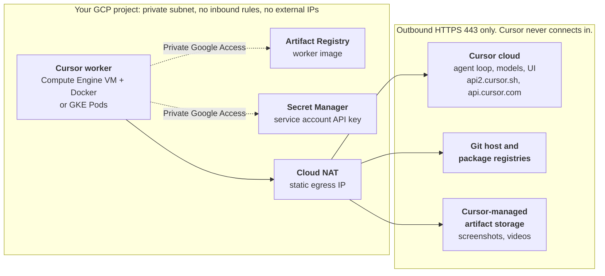

# Reference

## Architecture

## Required Egress

Workers need outbound HTTPS (443) to these hosts ([Team Pools networking](https://cursor.com/docs/cloud-agent/self-hosted/pool#networking)). Behind a proxy, set `HTTPS_PROXY` in the worker environment.

| Host | Used for |
| --- | --- |
| `api2.cursor.sh`, `api2direct.cursor.sh` | Agent session |
| `api.cursor.com` | Pool API and the GKE worker controller |
| `downloads.cursor.com` | Cursor CLI updates |
| `cloud-agent-artifacts.s3.us-east-1.amazonaws.com` | Artifact uploads. Blocking it disables artifacts only. |
| Your Git host and package registries | Clones, fetches, dependency installs |
| `REGION-docker.pkg.dev`, `secretmanager.googleapis.com` | Image pulls and secret reads, over Private Google Access |
| `deb.debian.org`, `packages.cloud.google.com` | Compute Engine only: Docker and Git install on first boot |

## Open Items To Confirm

- The first-boot Git token clone for repo-bound workers is untested with a real token. How agents push branches and open PRs from a repo-bound worker is also unconfirmed.
- Cursor's docs don't say whether the Cursor GitHub integration needs access to the repository for a repo-bound pool to appear under it.
- `--clone-git-repos` needs a team admin to enable GitHub token minting. Session tokens need Cursor to enable them for your team.
- Cursor stores agent artifacts (screenshots, videos, log references) in Cursor-managed storage outside your GCP project; review this for data residency ([Artifacts](https://cursor.com/docs/cloud-agent/self-hosted/pool#artifacts), [What leaves your network](https://cursor.com/docs/cloud-agent/self-hosted#what-leaves-your-network)).
- GKE Autopilot and Cloud Run are untested.
- Version pins are choices: `k8s-workers` 0.2.2, kubectl v1.36.5, Debian 12, Ubuntu 24.04, google provider `~> 6.0`, and the CLI build `cursor.com/install` serves (2026.10.01-e373342 when checked).
